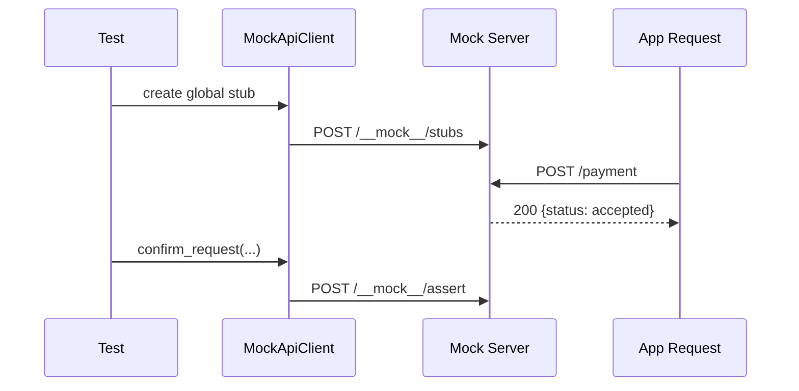
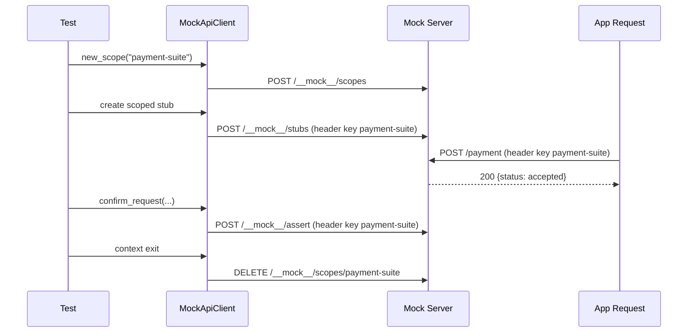

# End-to-End Example

This page shows both unscoped and scoped end-to-end flows.

## Serializable Criteria Keys

When sending matcher objects, use Assertive serializable keys such as:
`$gt`, `$gte`, `$lt`, `$lte`, `$between`, `$eq`, `$neq`, `$and`, `$or`, `$xor`, `$not`,
`$json`, `$contains`, `$contains_exactly`, `$regex`, `$length`, `$key_values`,
`$exact_key_values`, `$even`, `$odd`, `$ignore_case`.

Criteria objects from `assertive` are also serializable via the client. You can pass
criteria instances directly, and the client will serialize them automatically.

```python
from assertive import between

# Client input (Criteria object)
times = between(1, 3)

# Wire format sent to the API
# {"times": {"$between": {"lower": 1, "upper": 3, "is_inclusive": true}}}
```

## Unscoped Flow

```python
from assertive_mock_api_client import MockApiClient
import httpx

client = MockApiClient("http://localhost:8910")

client.when_requested_with(path="/payment", method="POST").respond_with_json(
    status_code=200,
    body={"status": "accepted"},
)

response = httpx.post("http://localhost:8910/payment", json={"amount": 42})

assert response.status_code == 200
assert response.json()["status"] == "accepted"
assert client.confirm_request(path="/payment", method="POST") is True
```



## Scoped Flow

```python
from assertive_mock_api_client import MockApiClient
import httpx

client = MockApiClient("http://localhost:8910")

with client.new_scope("payment-suite") as scoped:
    scoped.when_requested_with(path="/payment", method="POST").respond_with_json(
        status_code=200,
        body={"status": "accepted"},
    )

    response = httpx.post(
        "http://localhost:8910/payment",
        headers={"payment-suite": "1"},
        json={"amount": 42},
    )

    assert response.status_code == 200
    assert response.json()["status"] == "accepted"
    assert scoped.confirm_request(path="/payment", method="POST") is True
```



## Chaos Latency Example

```python
import httpx

httpx.post(
    "http://localhost:8910/__mock__/stubs",
    json={
        "request": {"path": "/slow", "method": "GET"},
        "action": {
            "response": {
                "status_code": 200,
                "headers": {"Content-Type": "application/json"},
                "body": {"ok": True},
            }
        },
        "chaos": {"latency": {"base_ms": 100, "jitter_ms": 50}},
    },
).raise_for_status()

response = httpx.get("http://localhost:8910/slow")
assert response.status_code == 200
```

With this config, each matched call incurs delay sampled from `100..150 ms`.

## Chaos Connection Drop Example

```python
import httpx

httpx.post(
    "http://localhost:8910/__mock__/stubs",
    json={
        "request": {"path": "/unstable", "method": "GET"},
        "action": {
            "response": {
                "status_code": 200,
                "headers": {"Content-Type": "text/plain"},
                "body": "possibly dropped",
            }
        },
        "chaos": {
            "faults": {
                "connection_drop": {
                    "probability": 1.0,
                }
            }
        },
    },
).raise_for_status()

with httpx.Client() as client:
    try:
        client.get("http://localhost:8910/unstable")
        raise AssertionError("Expected a transport/protocol error")
    except httpx.HTTPError:
        pass
```

With this config, each matched call is interrupted mid-response.

## Chaos Connection Drop (Client Fluent) Example

```python
from assertive_mock_api_client import MockApiClient
import httpx

client = MockApiClient("http://localhost:8910")

client.when_requested_with(path="/unstable-client", method="GET").with_connection_drop(
    probability=1.0
).respond_with(
    status_code=200,
    headers={"Content-Type": "text/plain"},
    body="possibly dropped",
)

with httpx.Client() as http_client:
    try:
        http_client.get("http://localhost:8910/unstable-client")
        raise AssertionError("Expected a transport/protocol error")
    except httpx.HTTPError:
        pass
```

This produces `chaos.faults.connection_drop` in the stub payload.
