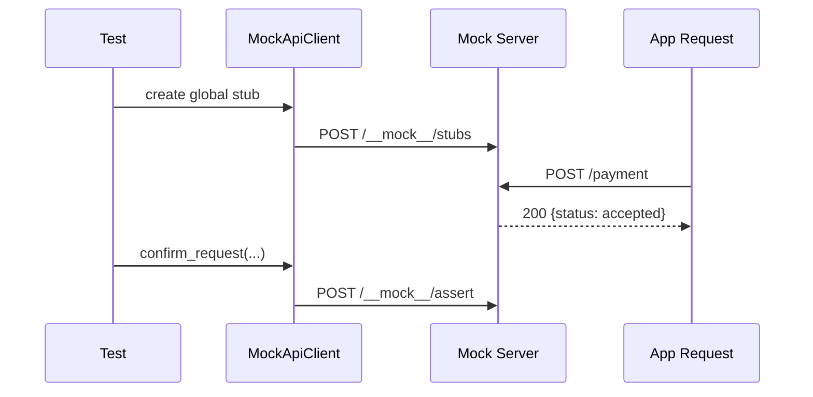
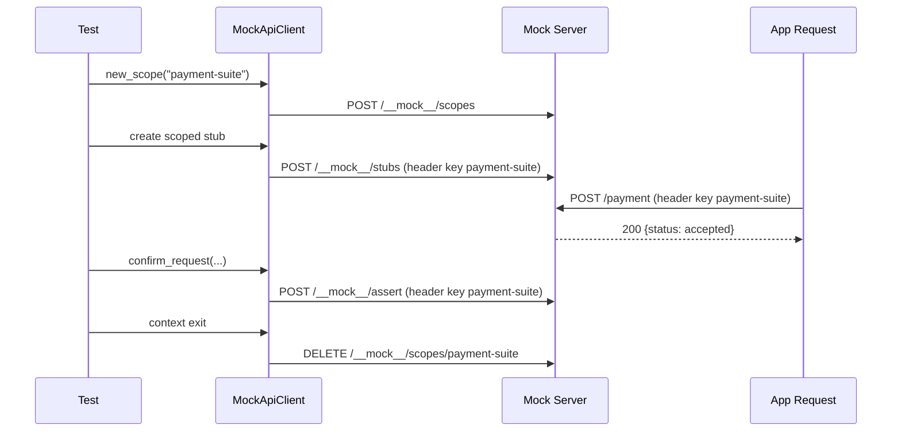

# End-to-End Example

This page shows both unscoped and scoped end-to-end flows.

## Unscoped Flow

```python
from assertive_mock_api_client import MockApiClient
import httpx

client = MockApiClient("http://localhost:8910")

client.when_requested_with(path="/payment", method="POST").respond_with_json(
    status_code=200,
    body={"status": "accepted"},
)

response = httpx.post("http://localhost:8910/payment", json={"amount": 42})

assert response.status_code == 200
assert response.json()["status"] == "accepted"
assert client.confirm_request(path="/payment", method="POST") is True
```



## Scoped Flow

```python
from assertive_mock_api_client import MockApiClient
import httpx

client = MockApiClient("http://localhost:8910")

with client.new_scope("payment-suite") as scoped:
    scoped.when_requested_with(path="/payment", method="POST").respond_with_json(
        status_code=200,
        body={"status": "accepted"},
    )

    response = httpx.post(
        "http://localhost:8910/payment",
        headers={"payment-suite": "1"},
        json={"amount": 42},
    )

    assert response.status_code == 200
    assert response.json()["status"] == "accepted"
    assert scoped.confirm_request(path="/payment", method="POST") is True
```


