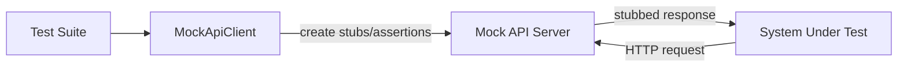

# Assertive Mock API

Assertive Mock API gives you a programmable HTTP mock server and a Python client for setting up stubs and validating request behavior in tests.

## What You Get

- A FastAPI-based mock server with scoped and global stubs.
- A Python client to create stubs and assert traffic.
- Docker-based deployment for local and CI usage.

## Quick Links

- [Server Overview](server/overview.md)
- [Docker Compose Deploy](server/docker-compose.md)
- [Server API Usage](server/usage.md)
- [Client Overview](client/overview.md)
- [Scoped Usage](client/scopes.md)
- [End-to-End Example](examples/e2e.md)
