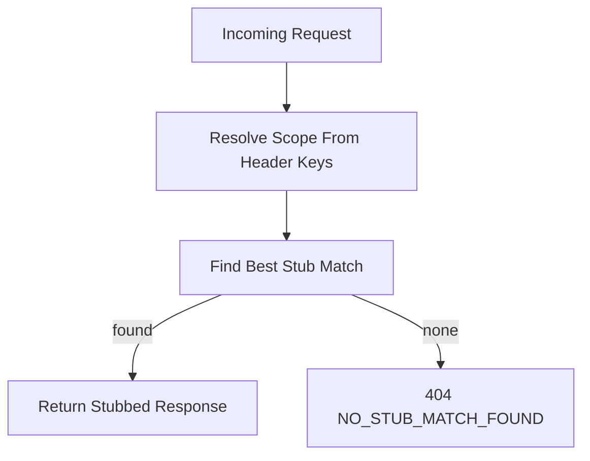

# Server Overview

The server stores incoming traffic and serves stubbed responses.

## Core Concepts

- `Stub`: request matcher + action (`response`, `proxy`, or `sse`).
- `Scope`: optional isolation boundary using request header keys.
- `Global`: stubs/requests without scope.
- `Admin UI`: in-app HTMX interface at `/__admin__` for managing stubs/scopes and inspecting traffic.

Scoped requests include both scope-specific and global stubs.

